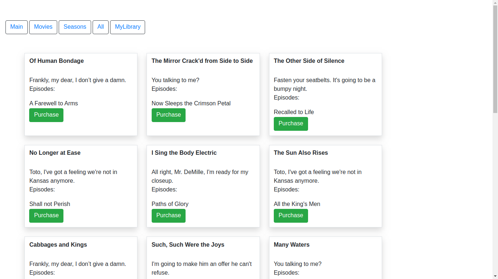

  <h3 align="center">Video Streaming Service</h3>

  <p align="center">

  
  
  </p>
    <p align="center">
    Ruby on Rails Project
    <br />
    <br />
    <a href="https://vidstreamservice.herokuapp.com/">View Demo</a>
    ·
    <a href="https://github.com/samgaco/vidstream/issues">Report Bug</a>
    ·
    <a href="https://github.com/samgaco/vidstream/issues">Request Feature</a>
  </p>
</p>


<!-- TABLE OF CONTENTS -->
## Table of Contents

* [About the Project](#about-the-project)
  * [Built With](#built-with)
  * [Deployment](#Deployment)
* [Contact](#Contact)

## About The Project

This project aims to model an online streaming service by listing Movies and Seasons of TV episodes.
We scroll through the navigation bar to find

* Movies, as the list of movies in our database ordered by creation.
* Seasons, a list of seasons ordered by creation listing its episodes.
* All, listing both Movies and Seasons ordered by creation.
* Library, a list of all the purchases made by the user that are currently activated. 

The User can puchase either a Movie or a Season and it will have it in its library for two days. The user will be able to see the remaining hours of his purchases in the library.
Once an item is expired and not in his library anymore, the user will be able to purchase the same item again, but the user is not going to be able to purchase the same item twice within a two day span.

## Built With

* [RubyonRails](https://rubyonrails.org/)

## Deployment

Clone the respository and run the following commands to run a local server.

Install all the dependencies with:

```
bundle install
```

Run the application with:
```
rails db:migrate
rails db:seed
rails s
```

The test can be run with:

```
bundle exec rspec
```

### Contact

👤 **Samuel García Companys**

* [Samuel García Companys](https://github.com/samgaco) - samuelgarciacompanys@gmail.com - [Linkedin](https://www.linkedin.com/in/samuel-garc%C3%ADa-companys-0a848284/)


## 📝 License

Distributed by the GNU General Public License. See `LICENSE` for more information.
